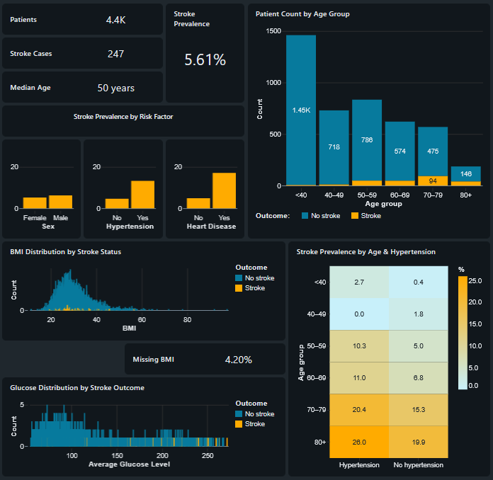

# Stroke Analytics and Machine Learning with Databricks

This project revisits a public stroke dataset using Databricks. It combines SQL-based exploratory analysis, interactive AI/BI dashboards, and a machine learning workflow for comparing classification models.

## Project goals

- prepare and validate the dataset using Python and SQL;
- explore stroke prevalence and associated demographic and clinical factors;
- present the exploratory analysis in an interactive Databricks AI/BI dashboard;
- compare several classification algorithms using a consistent preprocessing and cross-validation workflow;
- evaluate model performance using metrics appropriate for an imbalanced dataset;
- store model parameters, validation results, and test performance in Databricks tables;
- build dashboards comparing model performance and presenting the final selected model.

## Revisiting the original project

The earlier analysis explored decision trees, random forests, and support vector machines using separate model-specific scripts and grid searches.

The workflow was updated to:

- use a consistent preprocessing pipeline across models;
- keep preprocessing within cross-validation;
- evaluate models using metrics appropriate for an imbalanced dataset;
- compare models and hyperparameters in a common results table;
- separate model selection from final test-set evaluation;
- make the outputs available for visualisation in Databricks dashboards.

The scikit-learn guide on [common pitfalls and recommended practices](https://scikit-learn.org/stable/common_pitfalls.html) helped identify areas for improvement, particularly around preprocessing pipelines and data leakage.

## Tools

- Databricks
- Databricks SQL
- Databricks AI/BI Dashboards

## Dataset

The project uses the public Stroke Prediction Dataset available on Kaggle:
https://www.kaggle.com/fedesoriano/stroke-prediction-dataset

